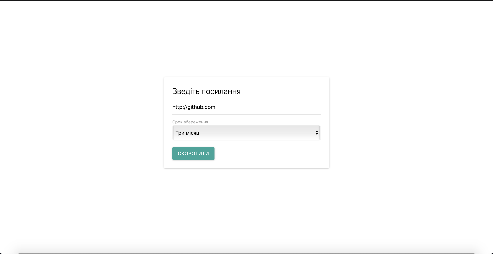
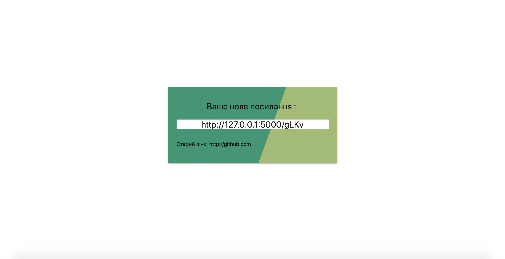

# Shorty

Basic link shortener that stores up to 14 million links for periods from single day to a year.

## Getting Started

These instructions will get you a copy of the project up and running on your local machine for development and testing purposes. See deployment for notes on how to deploy the project on a live system.

## Prerequisites

To run this program you will need to have python installed on the system.

### Linux
```
sudo apt-get install python3 python3-pip
```

### Mac OS
You will need to install hombrew first
```
$ ruby -e "$(curl -fsSL https://raw.githubusercontent.com/Homebrew/install/master/install)"
```
and then
```
brew install python3
```

### Windows
Head here to download 
```
https://www.python.org/downloads/windows/
```

## Installing

After you have python installed, first, in your project directory clone this git

```
git clone https://github.com/kpashko/shorty.git
```

Then head to shorty folder

```
cd shorty 
```

And install pipenv

```
pip3 install pipenv 
```
(if pip3 is not working try just pip)

Then run
```
pipenv install
```
Enter the shell
```
pipenv shell
```
And the app is ready. Start it with
```
flask run
```
If you are running on local, it should be available at http://127.0.0.1:5000/ by default

## Usage
Here is your main page:

here you just insert your link, choose it's lifetime et voilà
you receive your shortened url:



## API

There are currently 2 api calls implemented.

Whith one you can get your link shortened:
```
/api/s/<your_original_link>
```
it will respond with a shortened link

and the second one returnes details about your shortened link
```
/api/get_info/<your_short_code>
```
it will return dict with original link, it's creation date and expiration date.

